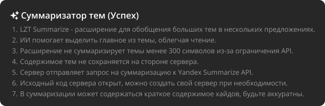
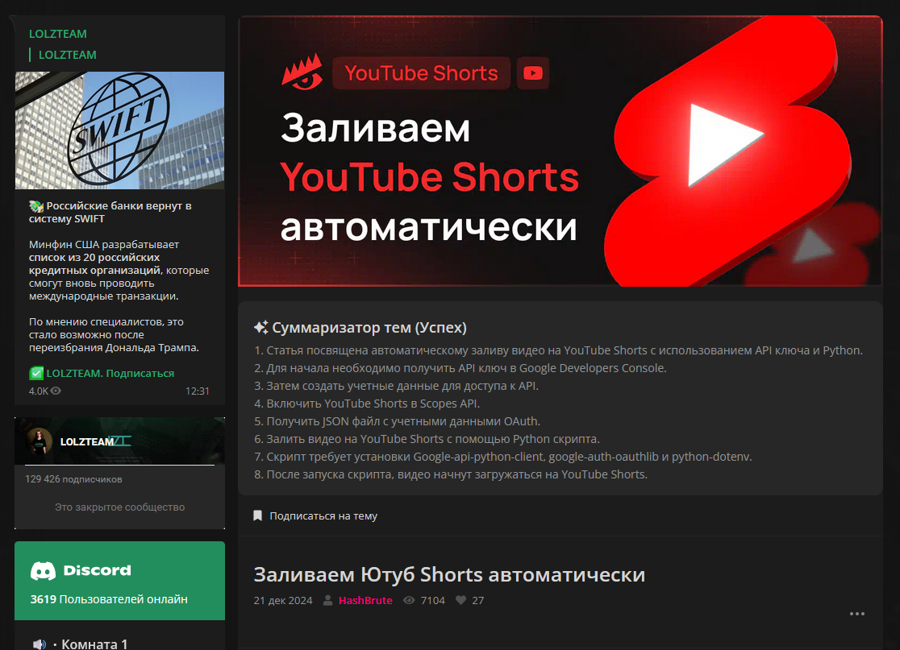
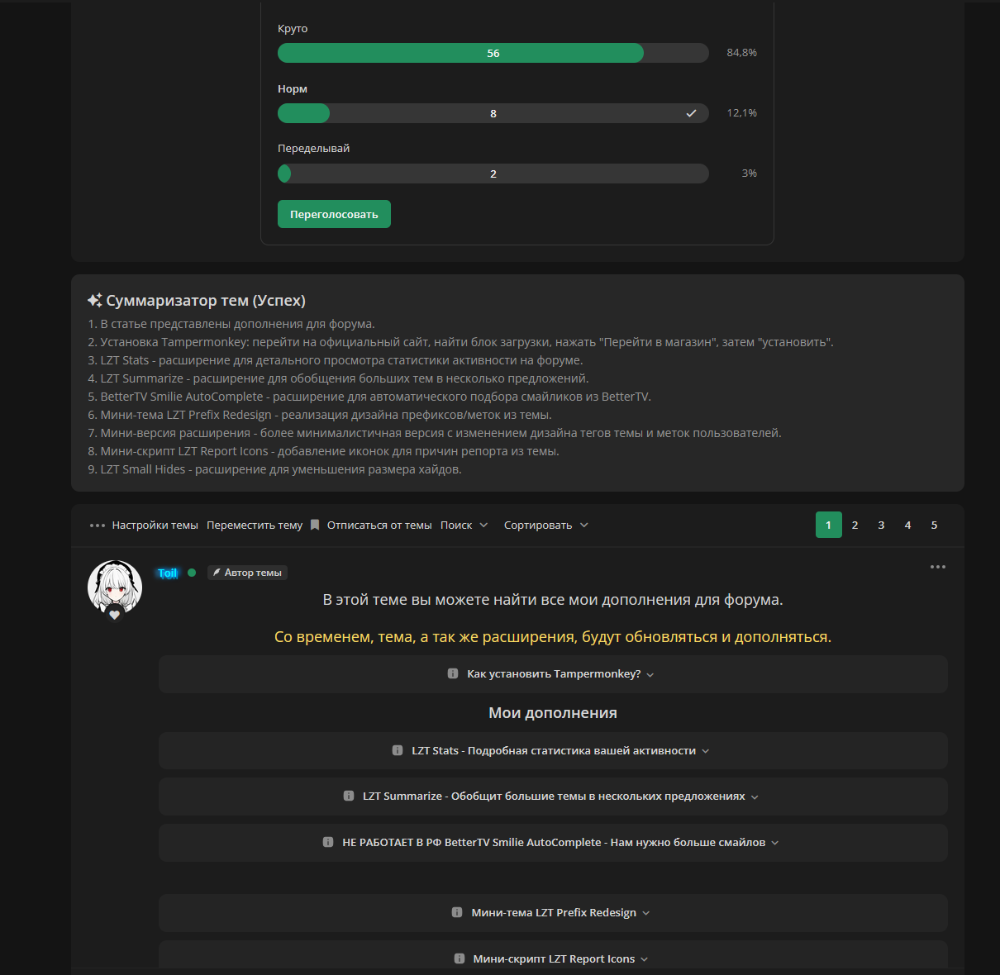
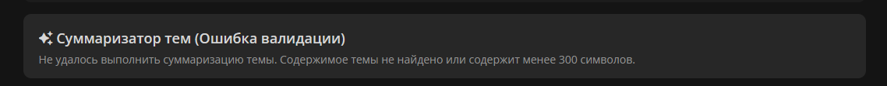

    <h1>LZTUpgrade Summarize</h1>
    

**LZT Summarize** - расширение, которое обобщит большие темы в нескольких предложениях. Теперь, вы сможете быстро пригодится ли вам эта тема станет еще легче. Благодаря ИИ расширение вынесет из темы все самое главное и вам останется прочитать всего несколько строчек заместо огромной темы.

## Обратите внимание

1. Расширение **не суммаризирует** темы, содержимое которых меньше 300 символов. Это ограничение API.
2. Содержимое тем **не сохраняется** на моей стороне. Единственное, что делает сервер - отправляет запрос на суммаризацию к Yandex Summarize API. Исходный код сервера открыт и при желание вы можете поднять свой сервер, если по какой-либо причине не хотите использовать мой.
3. В суммаризации может находиться краткое содержимое хайдов, будьте аккуратны.​

## Установка расширения:

> [!WARNING]
> Если вы пользуетесь Tampermonkey в Chrome, не забудьте включить режим разработчика!

1. Установите расширение **[Tampermonkey](https://www.tampermonkey.net/)**
2. Установите скрипт с **[Github](https://raw.githubusercontent.com/lzt-upgrade/lzt-summarize/master/lzt-summarize.user.js)** или с **[GreasyFork](https://greasyfork.org/ru/scripts/486180-lzt-summarize)**

## Скриншоты

    
Показать скриншоты

